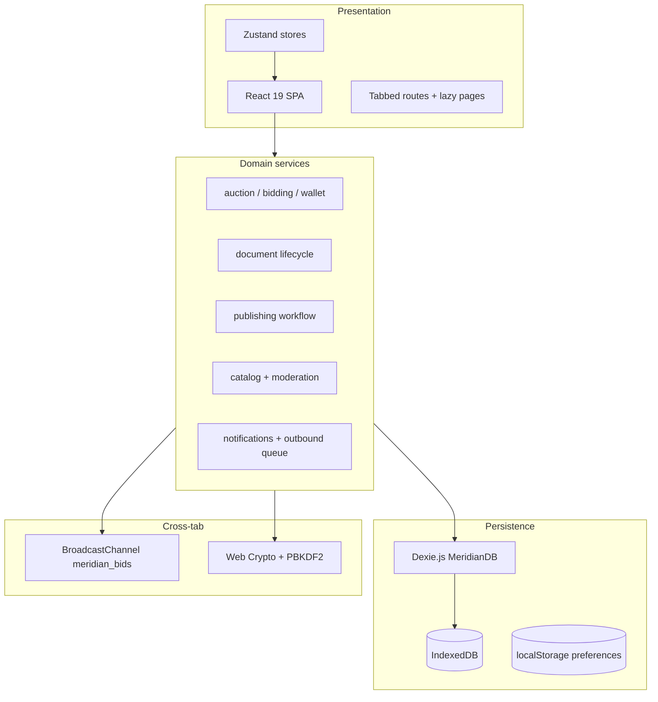

# Meridian Portal — Design Document

## 1. Purpose and scope

The **Meridian Offline Commerce & Compliance Portal** is a browser-only enterprise workspace for organizations that must run internal auctions, manage controlled documents, and publish regulated communications **without internet connectivity** at runtime.

Primary user roles:

| Role | Responsibilities |
|------|------------------|
| **Administrator** | System configuration, users, sensitive-word lists, audit review, data export |
| **Content Editor** | Catalog items, auctions, publications, documents (authoring) |
| **Reviewer / Approver** | Moderation queues, publication and document approvals, destruction approvals |
| **Participant** | Bidding, catalog browse, reading published content, trainings/notices as modeled in the app |

## 2. Architectural overview

- **Single-page application**: Vite-built static assets; routing is in-app (tabs + path patterns), not a separate HTTP router.
- **Offline-first**: No REST or GraphQL calls; all authoritative state lives in **IndexedDB** via **Dexie** (`MeridianPortal` database).
- **Security (local)**: Passwords use **PBKDF2**; sensitive payloads can use **Web Crypto** encryption; **append-only audit logs** record state-changing actions.

## 3. Key design decisions

1. **Auctions — no winner**  
   When an auction closes with no qualifying bids, treat as **No Sale / Expired**, notify seller roles, return inventory semantics per product rules.

2. **Wallet and deposits**  
   Deduct buyer deposit **only on win**. While bidding, use **reservation** semantics rather than final debit until outcome is known.

3. **Proxy bidding**  
   Deterministic engine: ordering by **timestamp and bid amount**, minimum increments, and documented anti-sniping.

4. **Anti-sniping**  
   If a bid lands in the final **30 seconds**, extend end time by **2 minutes**, **at most once** per auction.

5. **Documents — checkout**  
   **Exclusive checkout**: one active editor; others see lock state and holder identity.

6. **Document numbering**  
   Final number (e.g. `ORG-2026-000123`) assigned **only on transition Draft → Approved** to avoid gaps from rejected drafts.

7. **Retention and destruction**  
   Eligible destruction after retention requires **two-step approval** (Reviewer + Administrator), reason captured, **audit** entry mandatory.

8. **Sensitive words**  
   Moderation runs **on save** and **on submit for review**; publishing blocked until resolved.

9. **Analytics (offline)**  
   Local **view events** and time-on-page aggregated per session; export via admin **CSV/JSON**.

10. **Multi-tab bidding**  
    **BroadcastChannel** (`meridian_bids`) plus **IndexedDB transaction constraints** and **idempotency keys** on bids to prevent duplicate placement across tabs.

11. **Outbound communications**  
    **Queue in IndexedDB**; export CSV/JSON for manual dispatch — no live SMS/email from the app.

12. **Authorization**  
    **Explicit permission matrix** per role in code — no implicit inheritance between roles.

## 4. User interface model

- **Shell**: Left **navigation drawer** + **tabbed main area** (multiple documents/screens open as tabs).
- **Navigation**: Path-based tab URLs (e.g. `/auctions`, `/documents/:id`) resolved in `TabContent` with lazy-loaded pages.
- **UX expectations**: Loading states, error handling, toasts (e.g. Sonner), responsive layout, enterprise dashboard visual language (Tailwind).

## 5. Data model (summary)

Logical domains map to Dexie tables (see `api-spec.md` for table/index detail):

- **Auth**: users, sessions  
- **Audit**: append-only audit logs  
- **Auctions**: auctions, bids, proxy bids, wallets, wallet transactions  
- **Catalog**: items, categories, tags  
- **Publishing**: publications, versions, view events  
- **Documents**: documents, versions, checkout records, retention policies, destruction approvals  
- **Notifications**: in-app notifications, outbound queue  
- **System**: config singleton row, sensitive words  

Schema is versioned in Dexie; v1 declares tables up front with indexes for query paths.

## 6. Deployment and runtime

- **Docker Compose** can build and serve the static SPA (preview port **4173**) or run **Vite dev** (**5173**) with profiles.
- **PWA**: Service worker / workbox artifacts support installable/offline asset caching where configured.

## 7. Testing strategy

- **Vitest** unit and integration-style tests for critical domain logic (e.g. auction lifecycle, document checkout, publication flow, document numbering).
- **fake-indexeddb** supports DOM-less database tests.

## 8. Out of scope (by design)

- Central server synchronization, multi-user real-time collaboration beyond cross-tab broadcast patterns, and external identity providers.
- Automated delivery of email/SMS from the application (queue + export only).

---

*This design aligns with `SPEC.md`, `repo/CLAUDE.md`, and the implementation under `repo/src/`.*
